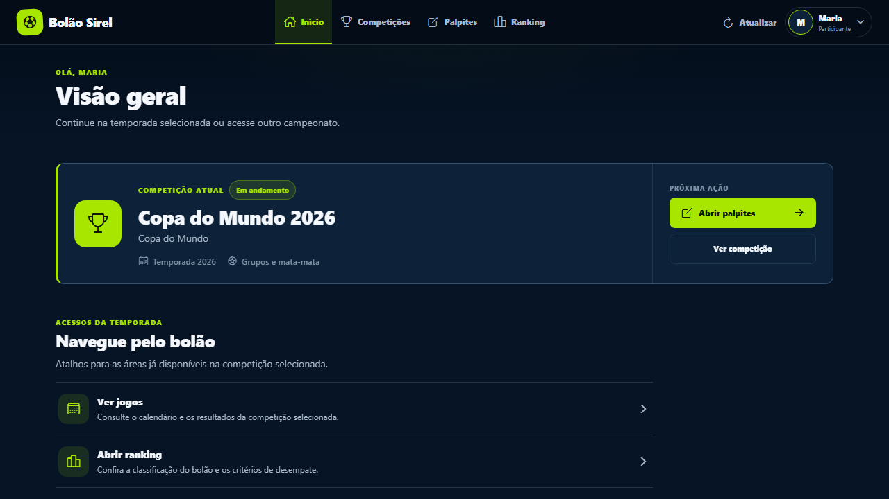
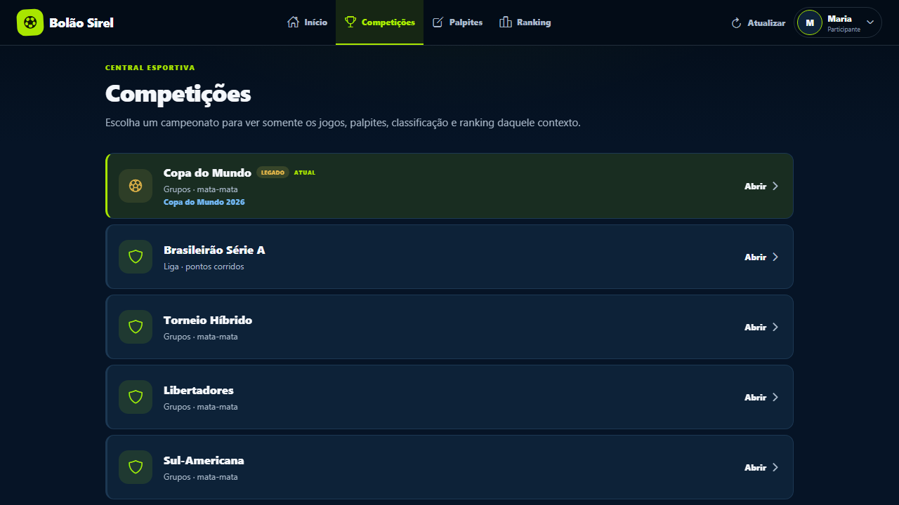
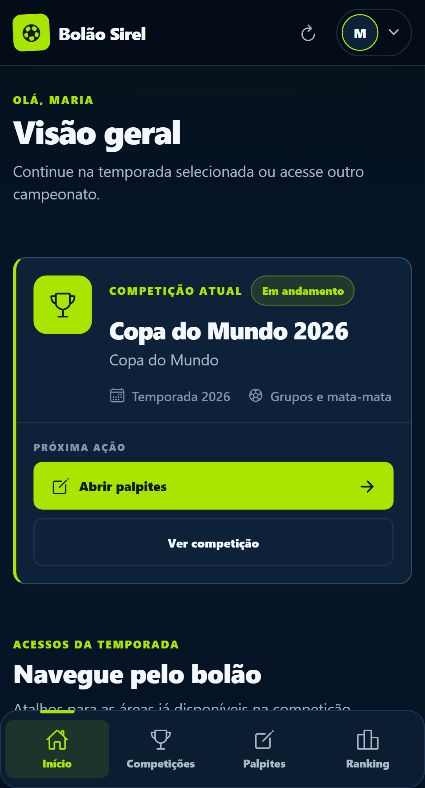
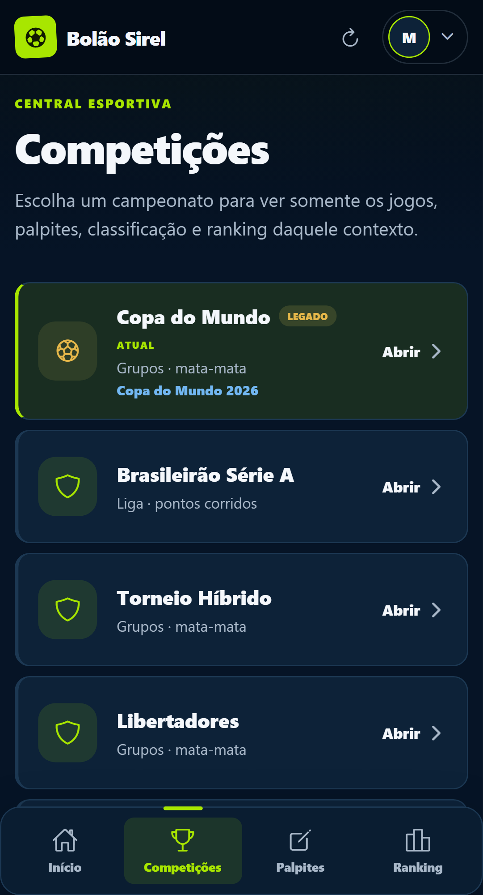

# Relatório final — redesign do Bolão Sirel

Data: 27/07/2026

Repositório: `kacarlos23/bolao-copa-2026`

Branch: `main`

Baseline: `9996ba2` — alinhada a `origin/main`

## Resultado

O frontend foi redesenhado com identidade noturna esportiva, superfícies azul-marinho, verde-limão
para ações e roxo como apoio. O trabalho preserva as rotas, APIs, payloads, permissões,
capabilities, regras de pontuação, deadlines, timezone, drafts, idempotência, feature flags,
fluxos administrativos e estados existentes.

Não foram criadas ligas, tiers, XP, confiança de palpite, favoritos, missões, perfil pessoal,
dashboard analítico ou dados ilustrativos. A aplicação continua usando somente dados reais
retornados pelos endpoints existentes.

## Auditoria e fases

| Fase | Entrega | Validação dirigida | Gates integrados | Regressões registradas |
| --- | --- | --- | --- | --- |
| 0 | auditoria de stack, rotas, estado, APIs, admin, riscos e plano por arquivo | baseline: 385 testes aprovados | lint e build aprovados; typecheck web com 99 erros preexistentes; E2E 58/60 | typecheck e seletor E2E ambíguo documentados e corrigidos na fase 1/7 |
| 1 | tokens, fundação visual, estados e primitivas compartilhadas | 89 testes web aprovados no checkpoint | typecheck, lint, build e budget aprovados | erros de tipagem da baseline eliminados; sem regressão aberta |
| 2 | shell, cabeçalho, conta, subnav e barra móvel de quatro destinos | 5 testes de navegação aprovados | gates integrados aprovados | sem regressão aberta |
| 3 | início com contexto e atalhos reais | 2 testes novos aprovados | gates integrados aprovados | nome acessível ajustado para não colidir com a navegação |
| 4 | central de competições, jogos, agrupamento civil, filtros e responsividade | 22 testes dirigidos de competição aprovados | gates integrados aprovados | sem alteração de agrupamento, deadline ou timezone |
| 5 | cartões de palpite, estados de draft e resumo operacional | incluída nos 22 testes dirigidos | gates integrados aprovados | estado `saving` deixou de ser anunciado como registrado; fluxo de save preservado |
| 6 | ranking desktop/mobile, pódio, tabela/lista e destaque do usuário | 8 testes de ranking aprovados | gates integrados aprovados | líder da rodada e critérios de desempate restaurados após o sweep E2E |
| 7 | painel administrativo real e fundraising | 4 testes dirigidos aprovados | gates integrados aprovados | rótulo duplicado `Gerar prévia` eliminado sem mudar handlers ou payloads |
| 8 | loading, vazio, erro, offline, toast, foco, movimento e acabamento | suíte integrada aprovada | 391 testes, typecheck, lint e build aprovados | QA visual encontrou e corrigiu conteúdo transparente, viewport móvel ausente e dois contrastes insuficientes |
| 9 | regressão, WCAG, seis larguras, build e evidências | 64 cenários E2E aprovados | todos os gates finais aprovados | nenhuma regressão conhecida aberta |

O relatório de auditoria completo está em `docs/redesign/auditoria-frontend.md`.

## Principais alterações

- Design system centralizado para container, card, cabeçalhos, chips e botões sem introduzir
  biblioteca nova.
- Header desktop compacto, contexto da temporada, conta real e navegação móvel fixa com
  `Início`, `Competições`, `Palpites` e `Ranking`.
- Home reconstruída com competição/temporada, formato, status e atalhos provenientes do contexto
  real.
- Competições e jogos reorganizados por data civil no timezone da temporada, com venue, status,
  filtros, placares e disponibilidade já existentes.
- Palpites com hierarquia mais clara para aberto, alterado, salvando, salvo, falha e fechado,
  mantendo o reducer, o salvamento em lote e o guard de alterações não salvas.
- Ranking adaptado para lista abaixo de 1024 px e tabela fluida no desktop, sem reordenar o
  resultado recebido do backend.
- Admin reorganizado em superfícies operacionais, mantendo seleção, preview, confirmação,
  justificativa, canário, idempotência, jobs e operações perigosas.
- `SoftReveal` usa animação CSS no web e `Animated` nas plataformas nativas; `prefers-reduced-motion`
  remove a animação.
- O HTML agora declara viewport responsivo e `viewport-fit=cover`.
- Contraste WCAG AA corrigido no indicador de conexão e na ação de atualização da competição.
- Typecheck explícito adicionado aos três workspaces.

## Componentes criados

Em `apps/web/src/components/DesignSystem.tsx`:

- `ResponsiveContainer`;
- `Card`;
- `SectionHeader`;
- `StatusChip`;
- `AppButton`;
- `PrimaryButton`;
- `SecondaryButton`;
- `DangerButton`.

Também foram criados o stub de ícones para testes e a declaração de tipos web necessária para
propriedades suportadas pelo React Native Web.

## Componentes e efeitos removidos

Nenhuma rota, API ou componente funcional público foi removido.

Foram retirados somente elementos visuais redundantes/pesados do ranking:

- painel interno de radar;
- partículas de clique;
- entrada GSAP específica do ranking;
- métricas duplicadas de média e maior quantidade de placares exatos.

Pódio, escopos, ordenação, pontos, desempates, líder da rodada, destaque do usuário, awards,
engagement e sala de troféus real permanecem disponíveis.

## Rotas afetadas

- `/`;
- `/competicoes`;
- `/competicoes/:competitionSlug`;
- `/competicoes/:competitionSlug/jogos`;
- `/competicoes/:competitionSlug/palpites`;
- `/competicoes/:competitionSlug/classificacao`;
- `/competicoes/:competitionSlug/chave` e alias `/eliminatorias`;
- `/competicoes/:competitionSlug/ranking`;
- `/competicoes/:competitionSlug/times`;
- rotas de atletas, partidas e estatísticas dos times;
- `/admin`;
- login, cadastro e menu de conta.

Os aliases legados e a experiência legada da Copa continuam preservados.

## Arquivos alterados

### Configuração e entrada

- `package.json`;
- `package-lock.json`;
- `apps/api/package.json`;
- `packages/shared/package.json`;
- `apps/web/package.json`;
- `apps/web/tsconfig.json`;
- `apps/web/vitest.config.ts`;
- `apps/web/app/+html.tsx`;
- `apps/web/App.tsx`;
- `apps/web/global.css`;
- `apps/web/e2e/critical-flows.spec.ts`.

### Shell, navegação e fundação

- `apps/web/src/theme/tokens.ts`;
- `apps/web/src/ui.tsx`;
- `apps/web/src/motion.tsx`;
- `apps/web/src/app/AppShell.tsx`;
- `apps/web/src/app/AppHeader.tsx`;
- `apps/web/src/app/CompetitionSubnav.tsx`;
- `apps/web/src/app/RoutedWorkspace.tsx`;
- `apps/web/src/app/navigation-shell.test.tsx`;
- `apps/web/src/navigation/RouteLink.tsx`;
- `apps/web/src/navigation/competition-navigation.test.ts`;
- `apps/web/src/navigation/legacy-route-aliases.ts`.

### Componentes e features

- `apps/web/src/components/DesignSystem.tsx`;
- `apps/web/src/components/AsyncState.tsx`;
- `apps/web/src/components/ConnectionIndicator.tsx`;
- `apps/web/src/components/RankingTable.tsx`;
- `apps/web/src/components/ScoreInput.tsx`;
- `apps/web/src/components/Toast.tsx`;
- `apps/web/src/components/UnsavedChangesModal.tsx`;
- `apps/web/src/features/home/HomeScreen.tsx`;
- `apps/web/src/features/home/HomeScreen.test.tsx`;
- `apps/web/src/features/competitions/CompetitionHub.tsx`;
- `apps/web/src/features/competitions/CompetitionExperience.tsx`;
- `apps/web/src/features/competitions/CompetitionExperience.test.tsx`;
- `apps/web/src/features/competitions/SeasonWorkspace.tsx`;
- `apps/web/src/features/competitions/predictionDays.test.ts`;
- `apps/web/src/features/competitions/publicPredictionsPresentation.ts`;
- `apps/web/src/features/rankings/PremiumRanking.tsx`;
- `apps/web/src/features/rankings/PremiumRanking.test.tsx`;
- `apps/web/src/features/teams/LeagueTeamsScreen.tsx`;
- `apps/web/src/predictionBoard.tsx`.

### Administração, serviços, tipos e documentação

- `apps/web/src/adminOperations.tsx`;
- `apps/web/src/brasileiraoAdmin.tsx`;
- `apps/web/src/features/admin/FundraisingAdmin.tsx`;
- `apps/web/src/features/admin/FundraisingAdmin.test.tsx`;
- `apps/web/src/services/api-client.ts`;
- `apps/web/src/services/drafts.ts`;
- `apps/web/src/test/vector-icons.tsx`;
- `apps/web/src/types/react-native-web.d.ts`;
- `docs/redesign/auditoria-frontend.md`;
- `docs/redesign/relatorio-final.md`;
- quatro capturas em `docs/redesign/screenshots/`.

O pacote de referências em `docs/bolao_sirel_redesign_codex/` foi preservado sem alterações.

## Testes e gates finais

| Comando | Resultado |
| --- | --- |
| `npm test` | PASS — 391 testes: 25 preservação, 29 shared, 242 API e 95 web |
| `npm run typecheck` | PASS — shared, API e web |
| `npm run lint` | PASS — API, docs, genericidade, preservação, web e shared |
| `npm run build` | PASS — shared, API e export estático Expo web |
| `npm run test:budget` | PASS — 2.399.203 / 2.400.000 bytes de JavaScript |
| `npm run test:e2e` | PASS — 64/64 em Chromium desktop e mobile |

Os E2E cobrem autenticação, teclado, logout, rotas, histórico, drafts, salvamento, bloqueio por
prazo, capabilities, troca de competição/temporada, mata-mata, ranking, operações administrativas,
rollback, SSE/offline, erros 401/403/409/500, WCAG A/AA, reduced motion, perfis de time e ausência
de overflow global em 320, 375, 768, 1024, 1366 e 1920 px.

## Regressões encontradas durante a execução

1. A baseline tinha 99 erros de typecheck web. Foram corrigidos com tipos explícitos, scripts
   reais, declaração web e ajustes de contratos sem mudança de runtime.
2. O E2E da baseline encontrava dois botões `Gerar prévia`. A ação de fundraising passou a se
   chamar `Revisar valor`; o fluxo continua preview → confirmação → aplicação.
3. O estado transitório de palpite anunciava registro durante o salvamento. A cópia agora
   diferencia `Salvando palpite` de palpite registrado.
4. A primeira versão do acabamento podia manter o conteúdo da rota com opacidade zero no web.
   A entrada foi migrada para animação CSS finita e validada por captura real.
5. O `+html` customizado não declarava viewport, fazendo o navegador móvel trabalhar com largura
   lógica de 980 px. O meta viewport foi restaurado com suporte a safe area.
6. Com o conteúdo finalmente visível ao axe, dois textos do hero apresentaram contraste 4,08/4,14.
   Ambos foram ajustados e a checagem WCAG A/AA passou em desktop e mobile.
7. O sweep de ranking identificou a ausência dos rótulos contratuais de líder da rodada e
   critérios de desempate após a simplificação visual. Os rótulos foram restaurados usando a
   ordem e os dados do backend.

Não há regressão funcional conhecida aberta.

## Limitações e avisos

- O bundle está dentro do limite, mas com apenas 797 bytes de margem; novas dependências ou
  efeitos devem ser avaliados contra o budget.
- Onde SSE não entrega um evento, alguns estados continuam seguindo o polling existente de até
  30 segundos; esse comportamento não foi alterado.
- A suíte emite avisos preexistentes sobre a futura migração da configuração Prisma 7 e sobre
  `NO_COLOR`/`FORCE_COLOR` no runner. Não são falhas do redesign.
- A conexão do navegador visual integrado falhou por uma limitação da sessão do ambiente. A
  validação visual e as capturas foram concluídas no Chromium real da suíte Playwright.

## Itens das referências descartados

- ligas públicas/privadas e ranking de amigos;
- tiers, divisões, XP e níveis;
- confiança, tendência e pontuação estimada do palpite;
- favoritos e lembretes;
- desafios, missões e recomendações;
- medalhas ou troféus não retornados pela API;
- perfil pessoal completo, clube do coração e preferências inexistentes;
- dashboard administrativo analítico, gráficos, CRUDs e métricas não retornadas;
- números, nomes, placares ou cards promocionais ilustrativos.

## Screenshots

### Desktop

### Mobile

